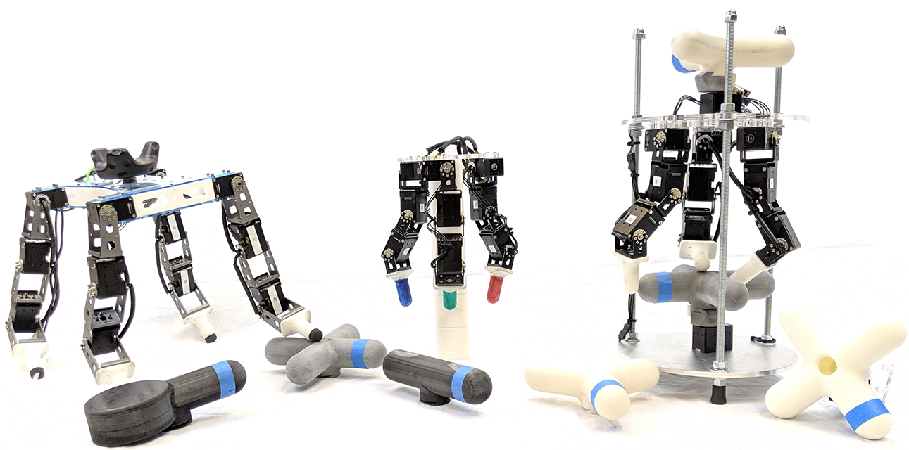

# **ROBEL**: **Ro**botics **Be**nchmarks for **L**earning

ROBEL is an open-source platform of cost-effective robots and associated
reinforcement learning environments for benchmarking reinforcement learning in
the real world. It provides Gym-compliant environments that easily run in both
simulation (for rapid prototyping) and on real hardware. ROBEL robots are robust
and scalable - they have facilitated over 14000 hours (as of Aug'19) of
real-world training with various learning-based methods. Benchmarks using
several learning-based methods are provided for ease of comparison and
extensibility. Refer to [ROBEL's webpage](http://roboticsbenchmarks.org) for
full details.

## Robot Platforms

|  |
:----------------------:
| ROBEL robots: D’Kitty (left) and D’Claw (middle and right) |

ROBEL introduces two robots that are modular, extensible, easy to build, and are
lower cost compared to many existing robotics research platforms:

1. **D'Claw** is a nine degree of freedom manipulation platform capable of
   performing dexterous manipulation.
2. **D'Kitty** is a twelve degree of freedom quadruped capable of agile
   locomotion.

## Features

1. **Gym Compliant** -- ROBEL environments are fully [Gym]-compliant and can be
used with any reinforcement learning library that interfaces with Gym
environments.
2. **Simulated backends** -- ROBEL also includes simulated equivalents of the
introduced benchmarks to facilitate prototyping and debugging needs.
Simulation backend is provided by [MuJoCo].
3. **Hardware interface** -- ROBEL is built using Dynamixel motors and
communicates with the hardware device through the [DynamixelSDK].
4. **External tracking support** -- For D'Kitty environments, external tracking
is supported through [OpenVR] tracking.
5. **Open-source design** -- The hardware design and build instructions are
fully open-sourced and are available for anyone to build their own robots.

[Gym]: https://gym.openai.com
[MuJoCo]: http://www.mujoco.org
[DynamixelSDK]: https://github.com/ROBOTIS-GIT/DynamixelSDK
[OpenVR]: https://github.com/ValveSoftware/openvr

# Getting started

## 1. Hardware assembly

Please refer to the
[Hardware Guide](http://roboticsbenchmarks.org/getting-started) for getting
started with the ROBEL hardware platforms.

## 2. Software installation

#### 2.1 MuJoCo

Download MuJoCo Pro 2.00 from the
[MuJoCo website](https://www.roboti.us/index.html). You should extract this
to `~/.mujoco/mujoco200`. Ensure your MuJoCo license key is placed at
`~/.mujoco/mjkey.txt`.

Add the following line to your `~/.bashrc` (or equivalent) in order for
`mujoco_py` to install properly:

```bash
export LD_LIBRARY_PATH=$LD_LIBRARY_PATH:$HOME/.mujoco/mujoco200/bin
```

Run `source ~/.bashrc` afterwards.

#### 2.2 ROBEL

ROBEL requires Python 3.5 or higher. You can install ROBEL by running:

``` bash
pip install robel
```

We recommend doing this in a `virtualenv` or a Conda environment to avoid
interfering with system dependencies or existing packages.

Alternatively, you can install directly from the repository by running:

```bash
git clone --recurse-submodules https://github.com/google-research/robel.git
pip install -e robel/
```

To run on hardware, additionally install the [DynamixelSDK] Python API:

```bash
pip install git+https://github.com/ROBOTIS-GIT/DynamixelSDK.git#subdirectory=python
```

#### 2.3 Example Usage

```python
import robel
import gym

# Create a simulation environment for the D'Claw turn task.
env = gym.make('DClawTurnFixed-v0')

# Create a hardware environment for the D'Claw turn task.
# `device_path` refers to the device port of the Dynamixel USB device.
# e.g. '/dev/ttyUSB0' for Linux, '/dev/tty.usbserial-*' for Mac OS.
env = gym.make('DClawTurnFixed-v0', device_path='/dev/ttyUSB0')

# Reset the environent and perform a random action.
env.reset()
env.step(env.action_space.sample())
```

Not specifying the `device_path` i.e. `env = gym.make('DClawTurnFixed-v0')`
creates the simulated equivalent of the above hardware environment. The
simulated and hardware environments have the same interface.

To interactively render a simulation environment, run:

```bash
python -m robel.scripts.rollout -e DClawTurnFixed-v0 --render
# Also try this with other tasks such as DKittyWalkFixed-v0
```

## Benchmark Tasks

### D'Claw

| Task      | Description                          |
| --------- | ------------------------------------ |
| **Pose**  | Match a set of joint positions.      |
| **Turn**  | Turn an object to a specified angle. |
| **Screw** | Continuously rotate an object.       |


### D'Kitty

| Task       | Description                                   |
| ---------- | --------------------------------------------- |
| **Stand**  | Stand upright.                                |
| **Orient** | Align heading with a target.                  |
| **Walk**   | Walk to a target location.                    |

## Contributing

We designed ROBEL to be an easily extensible platform for new robots, tasks, and
benchmarks. See [`CONTRIBUTING.md`](CONTRIBUTING.md) for a guide
on how to contribute.

## Citation

```
@misc{ahn2019robel,
    title={ROBEL: Robotics Benchmarks for Learning with Low-Cost Robots},
    author={Michael Ahn and Henry Zhu and Kristian Hartikainen and Hugo Ponte and Abhishek Gupta and Sergey Levine and Vikash Kumar},
    year={2019},
    eprint={1909.11639},
    archivePrefix={arXiv},
    primaryClass={cs.RO}
}
```

## Disclaimer

This is not an official Google product.
